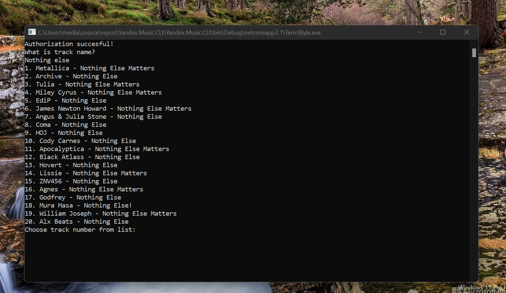
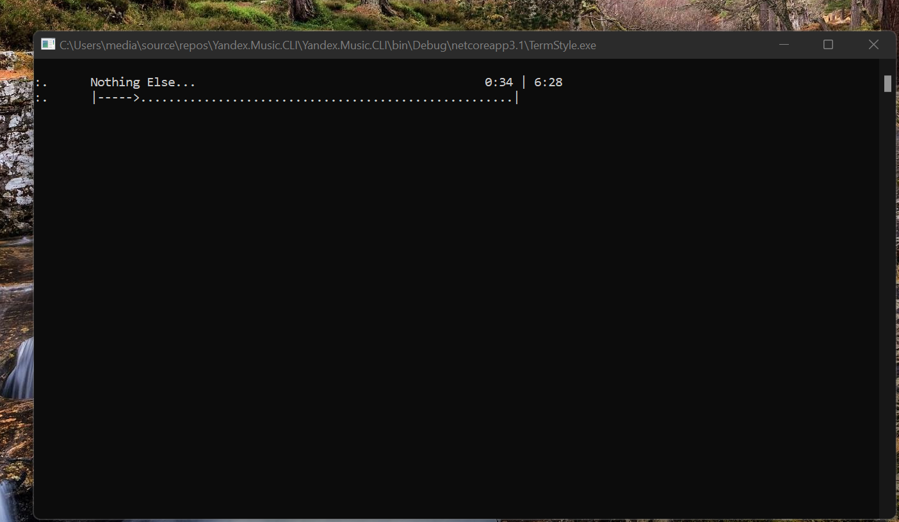

# Yandex.Music.CLI

Forked from: https://github.com/Winster332/Yandex.Music.Api

## Abstract
Allows you to listen to music through Yandex integration in the terminal

Original status: lost (obsolete)

## My actions (my 2 cents) 

1. Lite bugfix (some try...catch added to avoid accident app halts...)

2. Simple CLI mode for music track search query (by track name)

## Description

Sorry, this is not for Universal Windows Platform yet... It's "classic" app based on .NET Core 3

Idk how to port this "lib/app" into UWP... and .NET Standard 1.4 :(

Note: This project was created as a proof-of-concept over a short amount of time. 
The code may not be perfect. It exists for demonstration and educational purposes. Feel free to fork this project!

## Screenshots

## Coding "workbench"

1. Visual Studio 2022 (But VS 2017 compatibility remained, for Live WinPhone debugging, heh!)

2. .NET Core 3.1

## Test scenario

Compile

Start app

Authorize on Yandex.Music service

Make some track search, i.e. "Nothing else"

Choose 1 ("Metallica")

Enjoy the good sound :) 

## Project status

phase 1 Intro/RnD +- 0.6/100

phase 2 Design - 

phase 3 Tech. project -

phase 4 Dev. project  -

phase 5 Tests/Intro   -

## References
This project uses code from the following projects:

<a href="https://github.com/Winster332/Yandex.Music.Api">Yandex.Music.Api C# Project</a>

## Contribute!
There's still a TON of things missing from this proof-of-concept (MVP) and areas of improvement 

With best wishes,

  [m][e] 2021

Yandex.Music.CLI is RnD project only. AS-IS. No support. Distributed under the MIT License.